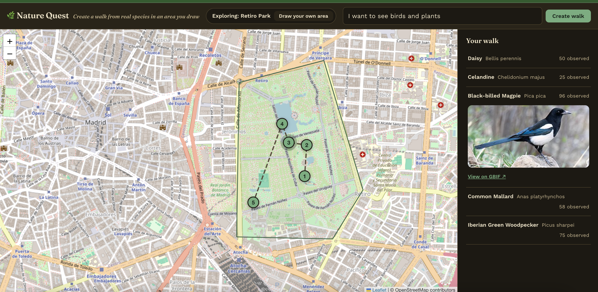

# Nature Quest

Nature Quest aims to make it easier and more fun to find interesting nature nearby and get out and experience it, by turning natural-language requests ("Show me some birds and plants!") into guided nature walks grounded in real species observations, for any drawn area in the world. Each walk comes with an AI-generated audio narrative guide, so you can listen to the story of what you're seeing hands-free as you walk the route.

**Live**: https://nature-quest-production-465dsuxpnq-ew.a.run.app



## Running it locally

**Prerequisites:**
- Python 3.13
- Node 22
- An [Anthropic API key](https://console.anthropic.com/) — required; `POST /api/query` makes a real LLM call
- (Optional) a PostHog project token — only needed to test server-side PostHog capture (`consent=True`)

Two servers, in separate terminals:

```bash
# backend — POST /api/query needs ANTHROPIC_API_KEY in a repo-root .env (gitignored);
# add POSTHOG_PROJECT_TOKEN too if testing server-side PostHog capture (consent=True)
cd app/backend
python -m venv venv && source venv/bin/activate   # first time only
pip install -r requirements-dev.txt                # first time only
uvicorn main:app --reload --port 8000

# frontend
cd app/frontend
npm install       # first time only
npm run dev
```

The frontend dev server proxies `/api` and `/health` to the backend (`vite.config.ts`), so both run together as one app at `http://localhost:5173`.

## Deploying

Merging to `main` deploys automatically via GitHub Actions (Workload Identity Federation, no static keys — see `docs/decisions/ADR-005`). For one-off manual deploys before/outside CI, see `infra/README.md`. `main` is branch-protected (no direct pushes, merges require maintainer approval), and only the maintainer holds GCP deploy credentials.

Exploring deployment/infra yourself additionally needs: Docker, the `gcloud` CLI, the `gh` CLI, and Terraform (for infra changes) — plus GCP credentials with access to the project, which only the maintainer currently holds.

## Finding your way around

- **`ARCHITECTURE.md`** — the current, whole-system map: components, request flow, deploy flow. Start here.
- **`docs/decisions/`** — ADRs, the "why" behind significant technical decisions.
- **`docs/specs/`** — technical specs for each slice of work, precise enough to build from.
- **`docs/prds/`** — product requirements: vision, phases, personas.
- **`docs/status_docs/`** — session-by-session notes (`WORK_SUMMARY_*.md`, `DDMMYY` date order).
- **`prototypes/`** — throwaway code that validated the original pipeline concept (species selection → waypoint ordering → enrichment/narrative → presentation) before any production code was written. Untouched, never deployed, not part of the current architecture — see `prototypes/README.md`.

## Open source

Nature Quest is built in the open from its first commit — code and documentation are public from the outset, so other developers can contribute or fork and rebuild. See `docs/decisions/ADR-008-open-source-from-day-one.md` for what that implies for security posture and CI/CD design.

A LICENSE has not been chosen yet — until it is, the terms under which this code may be used, forked, or contributed to are undefined.
